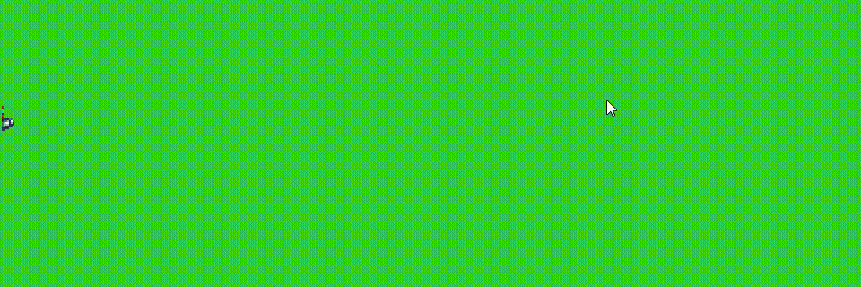

# Portfolio of my personal and public projects.

This README introduces and describes some of my personal and public programming projects.


## Herder:
Repository: <a href="https://github.com/Ex05/herder">herder</a>.

<a href="/img/img_001_herder_console_output.png">
	
</a>

The Herder project aims to create a feature-rich, blazing fast media organization tool with multiple front-end implementations, including a native C console application with true color support, a operating system-independent Java GUI application, and a HTML-5 based Web application.

The project originally started as a personal study exercise on the usage of modern C, advanced usage of preprocessor macros, low-level memory management, multi-threading and processing, scalable I/O event notification in a GNU/Linux environment, and secure network communication via 'TLS'. With the side goal of trying out the viability of different git branching strategies.
<br/>

<a href="./img/img_002_herder_build_script_output.png">
	
</a>

### Currently Herder features:
* A custom shell script-based build system.
	* Which forgoes the use of precompiled files and instead uses a single compilation unit per executable approach.
	This reduces compilation times down to the millisecond realm. And enables a test-driven development style where rebuilds become part of the workflow. And thus, rebuilding the project and/or the running of unit tests can occur after each small edit of the source code.
	* Has automated memory leak detection using valgrind for test builds.
	* Supports multiple build targets to create server and client executables from the same source tree. As well as multiple predefined build options for 'test', 'debug' and 'release' versions with varying levels of optimization.
* A macro-based minimal unit test framework without external dependencies.
* Event based client connection management using epoll in edge trigger mode.
* Multithreaded handling of client connections using reusable threads through a custom thread pool implementation that utilizes POSIXs parallel execution and communication model.
<a href="./img/img_003_herder_http_response_header.png">
	
</a>

* A custom IPv6 based web server implementation using the minimal required elements of the HTTP/1.1 standards to serve web content. With caching support for static content.
* Secure server client communication via TLS 1.3 with TLS_AES_256_GCM_SHA384 as chiper. Using LibreSSL, a fork of the BSD teams OpenSSL project, as the TLS implementation provider.
* Support for loading and persistently storing application related settings in a human readable format on disk.

The current git branching strategy for this project is Adam Rukas' OneFlow branching model in the variation 'develop + master' following the third option of first rebasing and then merging feature branches with fast forwarding disabled.

---
## NewsletterCreator:
Repositories: <a href="https://github.com/Ex05/NewsletterCreator">NewsletterCreator</a>, <a href="https://github.com/Ex05/NewsletterCreator/tree/main/src/Modelbahn%20West%20%5BNewsletter-Creator%5D/src/de/janik">GUI-Application</a>, <a href="https://github.com/Ex05/NewsletterCreator/tree/main/src/Modelbahn%20West%20%5BHTTP_Server%5D/src/de/janik">Server</a>.

<a href="./img/img_004_newsletterCreator_dragEditor.png">

</a>

The NewsletterCreator project was an entry for a freelance job competition. The goal was to create a suite of software applications to move the creation and sending of advertisement emails in-house to reduce advertisement spending. An additional factor was the ability to collect user data about whether emails were opened by recipients and which products led to click-throughs to the web shop and later to sales.

<a href="./img/img_005_newsletterCreator_webView.png">

</a>

The newsletter software would also be required to talk to the company's already existing relational database for their web shop to create customized newsletters on a per-user basis.

The two principal components of the project are a custom web server to serve online content and collect data on click-throughs and email openings.

And a GUI application to create new newsletters and manage previously sent batches of emails.
A version management server that was used during development to remotely update the application is also included in the project.

The Java based web server, a minimal working implementation of the HTTP standard, for educational purposes refrains from using the com.sun.net.httpserver implementation of a web server that has been available in the Oracle jdk sine JavaSE 6.

The server implementation supports multithreaded handling of client connections, caching of requested data, handling of different request types, and compression of data using gzip.

<a href="./img/img_006_newsletterCreator_editor.png">

</a>

The GUI application uses heavily customized javax.swing components to create its unique look and feel. And incorporates modern JavaFX elements, namely the javafx.scene.web.WebView, to give a live preview inside the application of the final newsletter during the creation process.

The editor provides predefined newsletter elements, like:
* Header.
* Footer.
* Text with and without titles.
<a href="./img/img_007_newsletterCreator_send_test_mail.png">

</a>

* Images with and without titles.
* Special/ reduced price offerings.

After being added to the newsletter, each element can then be modified via its own editing widget.
When adding imagery to elements, the source images can be loaded from either the system's hard drive or directly from the internet.

The generated HTML and CSS source code can be viewed and edited from inside the application.

After a newsletter has been created, a local copy can be opened in an external web browser through the application to check for the correct display of all elements.

Lastly, before sending a batch of newsletters, the application allows for the sending of test emails to check for proper delivery and display in different mail clients.

---
## SoftEngine:
Repository: <a href="https://github.com/Ex05/SoftwareEngineeringProject">SoftEngine</a>.

<a href="https://www.youtube.com/watch?v=dpM582QhSA0">

</a>

Created as a programming exercise for a software engineering class. SoftEngine is a software-based 2D game/rendering engine with support for:
* Multithreaded client-side network handling.
* Networked in-game chat.
* Multithreaded server side handling of clients.
* Event-based resource loading with support for non-uniformly weighted progress bars.
* Image loading and manipulation utilities. 

<a href="./img/img_009_softEngine_samus_run.png">

</a>

* User account creation & login management. Using salted & hashed passwords stored in an external MySQL database.
<a href="./img/img_010_softEngine_animationPreset_code.png">

</a>

* An easy to use framework to load and use animated bitmap based sprites through the definition of animation presets.
</br>

<a href="./img/img_011_softEngine_samus_run.gif">

</a>

In addition, SoftEngine provides a long list of UI elements, most of which support focus traversal, like:
* Buttons with Text and Bitmap based Images.
* Labels.
* Menus that support nested sub-menus.

* Colored and textured Rectangles.
<a href="./img/img_012_softEngine_account_creation.png">

</a>

* TextFields.
* PasswordFields.
* DropShadows for text.

The SoftEngines UI framework design also allows for the creation of custom UI elements with support for transparency, animations, focus traversal, and key/mouse input handling.

Lastly, using Gradle as a build system allows for the inclusion of supprojects, and thus the Softengine project provides the following utilities as supprojects:
* CrashHandler.
* ImageLoader.
* PasswordService.
* ResourceLoader

---
#### CrashHandler:
Repository: <a href="https://github.com/Ex05/SoftwareEngineeringProject/tree/master/CrashHandler">SoftEngine/CrashHandler</a>.

<a href="./img/img_014_crashHandler_output.png">

</a>

Using the java.lang.ProcessBuilder & Process classes as its backbone, the CrashHandler utility allows for the monitoring of Java processes and their output streams.

When built, the CrashHandler utility creates a runnable .jar file, which when run, executes the first .jar file in its directory that is not itself and displays the stdout & stderr output streams of the underlying running process via its ProcessMonitor.
In the event that the running process crashes, a CrashView with the returned exit code is shown.
The output streams and returned exit code can be differentiated in the ProcessMonitor by their respective text output colors.

---
#### ImageLoader:
Repository: <a href="https://github.com/Ex05/SoftwareEngineeringProject/tree/master/ImageLoader/src/main/java/de/janik/imageLoader">SoftEngine/ImageLaoder</a>.

The ImageLoader utility provides functionalities to load and manipulate images.
The ImageLoader is implemented using the singleton design pattern to control access to said functionality. 

The provided functionalities are:
* Loading files from disk and the web.
* Resizing.
* Resizing to fit a specified width or height, while keeping the current aspect ratio.
* Using different scaling functions to perform resizing operations.
* Changing of the underlying format used to store the image data.

The ImageLoader instance allows for lazy evaluation.
Through this aproach the following code snippet:
```java
final ImageIcon icon = ImageLoader.GetInstance().type(TYPE_BYTE_GRAY).resizeToFitWidth(1920).setInputURL("website.de/image.png").load().asImageIcon().get();
```
is just as valid as:
```java
final BufferedImage img = ImageLoader.GetInstance().setInputFile("~/Images/img_001.jpg").load().setScaleFunction(SMOOTH).resize(1920, 1080).type(TYPE_4BYTE_ABGR).asImage().get();
```
---
#### PasswordService:
Repository: <a href="https://github.com/Ex05/SoftwareEngineeringProject/tree/master/PasswordService/src/main/java/de/janik/passwd">SoftEngine/PasswordService</a>.

The PasswordService utility provides functionalities around the secure usage, generation and storage of non-plain text passwords through the use of salted and hashed passwords.

The provided functionalities are:
* Generation of PBKDF2WithHmacSHA256 hashes from plain text passwords.
* Generation of SHA1PRNG based salts.
* Comparison of salted password hashes in constant time to prevent timing attacks during login attempts.

---
### ResourceLoader:
Repository: <a href="https://github.com/Ex05/SoftwareEngineeringProject/tree/master/ResourceLoader/src/main/java/de/janik/util/resource_loader">SoftEngine/ResourceLoader</a>.

<a href="./img/img_015_resourceLoader_modelbahn_west.png">

</a>

The ResourceLoader utility can be used as the backend implementation for progress bars or to load resources in the background of running programs.

Through the definition of non-uniformly weighted resources the ResourceLoader utility allows for accurate representation of the resource loading status. 

<a href="./img/img_016_resourceLoader_loading_complete.png">

</a>

Events are utilised to inform over completed resource loading operations.

Multithreading allows for the ResourceLoader utility to be used for loading resources in the background of running applications.

---
## NativeLibraryLoader:
Repository: <a href="https://github.com/Ex05/NativeLibraryLoader">NativeLibraryLoader</a>.

<a href="./img/img_017_nativeLibraryLoader_source_code.png">

</a>

The NativeLibraryLoader utility allows the management of non java, hardware and operating system dependent native libraries through Java code. After a library has been successfully loaded into the Java runtime environment, its functions can be called through the foreign function interface provided by the Java virtual machine via methods, functions and procedures marked with the native keyword.

An example of calling a function written in x86-64 assembly using Intel syntax, compiled using NASM the Netwide Assembler for GNU/Linux-based operating systems and MASM the Microsoft Macro Assembler for Windows,
via a dynamically linked/loaded library created using gcc the GNU Compiler Collection on GNU/Linux and Visual Studio on Windows can be found <a href="https://github.com/Ex05/NativeLibraryLoader/blob/master/src/de/janik/Main.java">here</a>.

---
## Devils-Cloud:
Repository: <a href="https://github.com/Ex05/archived_projects/tree/master/Devils-Cloud/Devil's%20Cloud%20%5Bv2%20(1).0%5D">Devils-Cloud</a>.

<a href="./img/img_018_devilsCloud_lighting.gif">

</a>

The Devils-Cloud engine is a OpenGL-based Java 3D Game/Rendering-Engine. And is the result of my continued experiments with GPU-based rendering in late 2013.

The project uses the Lightweight Java Game Library (LWJGL) as a translation layer to access hardware-dependent OpenGL/graphics card functionality from within the Java runtime environment.

And employs modern rendering techniques like:
* Phong shading for GPU-based computation of lighting information for directional
 and point lights and the resulting specular and diffuse reflections.
 
<a href="./img/img_019_devilsCloud_character.png">

</a>

* Physically based rendering via the use of height and normal maps for materials .
* Rendering using Vertex Array Objects and Vertex Index Objects to reduce the GPU data transfer volume and number of GPU calls per render frame.
* The use of OpenGL shader programs, which make use of vertex, fragment, and geometry shaders.

<a href="./img/img_020_devilsCloud_gate.png">

</a>

Other features include:
* Loading and parsing of Wavefront Material Template Library (.MTL) material files.
* Loading and parsing of Wavefront OBJ geometry (.obj) file based 3D models.
* Integrated support for textured meshes and simple 3D objects such as:
	* Spheres.
	* Cubes.
	* SkyBoxes.

* Camera implementation supporting pitch and yaw control using Euler angles.

<a href="./img/img_021_devilsCloud_plane_fog.png">

</a>

* Tick based framework for input/output and physics handling.
* Change between full-screen and windowed mode.
* Display and rendering resolution selection.
* Limitation of camera view distance via the use of fog.
* Entity system for object/physics handling.
* Normalization of model vector meshes.
* Scaling and rotating of models & meshes.
* Support for loading, linking, compiling, validating and managing shader programs.
* The ability to pass high-level Java objects to shader programs.
<a href="./img/img_022_devilsCloud_cube.gif">

</a>

* Support for manually or automatically created mipmaps for textures at the time of loading.
* Texture wrapping for objects with texture 
* For rendered text, multiple languages are supported.
* Storage of settings in human readable text based files.
* Rendering of the OpenGL context in/through an AWT component, which can be nested inside a Swing component
* Physics affected particles and particle emitter.
* 2D font rendering in 3D space.

---
## DeepMiner:
Repository: <a href="https://github.com/Ex05/archived_projects/tree/master/DeepMiner/DeepMinerGame">DeepMiner</a>. Video: <a href="https://www.youtube.com/watch?v=pMQIDRnnPsc">youtube</a>.

<a href="https://www.youtube.com/watch?v=pMQIDRnnPsc">

</a>

Having been created in 2012, the DeepMiner project represents the first step of my journey in learning about and applying GPU based rendering techniques.

DeepMiner was created with the help of resources like the OpenGL SuperBible, the OpenGL Programming Guide and Oskar Veerhoek's LWJGL video series.

Utilising only OpenGL 1.1 functionality made accessible to the Java runtime by the Lightweight Java Game Library (LWJGL). DeepMiner makes all its rendering calls in OpenGL's immediate mode and has to resend all its rendering information every frame for every displayed object.

This technique is often regarded as depreciated and equal to the 'Hello World' of OpenGL based graphics programming.

DeepMiner uses an orthogonal projection for its 2D rendering. Supports textures.
And transparency for said textures via alpha blending.

Loading and creating of save files is accomplished via a .xml file created using the open-source JDOM library.

---
## SpaceGlider:
Repository: <a href="https://github.com/Ex05/archived_projects/tree/master/SpaceGilders/src/com/janik_2020/net">SpaceGlider</a>. Video: <a href="https://youtu.be/nSsCRNShUGQ">youtube</a>.

<a href="https://youtu.be/nSsCRNShUGQr">

</a>

SpaceGlider is a 2D Java game utilizing software-based rendering.

SpaceGlider supports text/font and and bitmap-based sprite rendering via the Abstract Window Toolkits (AWT) built-in Graphics2D object.

The game's collision detection code is based on zetcode's 2012 article on "Collision detection in 2D Java games.".

Music and sound effects are played using a custom wrapper for the audio manipulation functionality provided by the javax.sound package.

<a href="https://youtu.be/nSsCRNShUGQr">

</a>

A Windows native executable (.exe) of the game was created with the help of the Launch4j utility.

<br/>
<br/>
<br/>
<br/>
<br/>
<br/>
<br/>
<br/>
<br/>

---
## IT-Craft:
Repository: <a href="https://github.com/Ex05/archived_projects/tree/master/IT-Craft">IT-Craft</a>.

<a href="./img/img_026_itcraft_launcher.pngt">

</a>

The IT-Craft launcher is a collection of Windows batch scripts. Initially created for the alpha and beta release versions of the game Minecraft at the beginning of the year 2011.
The script enables the changing of Java virtual machine runtime arguments to customize the size of the jvms allocated heap memory when running the game.
The functionality to change the game's default textures or run modified versions of the game, which benefit from a larger available heap size, is also provided through the launcher.

The project provides four scripts:
* An installation script.
* The launcher script.
* A script to clear all saved data created by the launcher.
* And an uninstallation script.
